# 连接到钉钉上

我们提供保姆级（小白也能用！）的简易配置方法，让你轻松把留白上的记事备份到钉钉上。

配置只要 5 分钟!! 超过 5 分钟者，请直接[联系客服](https://work.weixin.qq.com/kfid/kfcfb6f3959d36f6a0f)，我们在线为你服务。

## 开始

### 1. 新建多维表格

打开[钉钉文档](https://alidocs.dingtalk.com/i/desktop)首页。

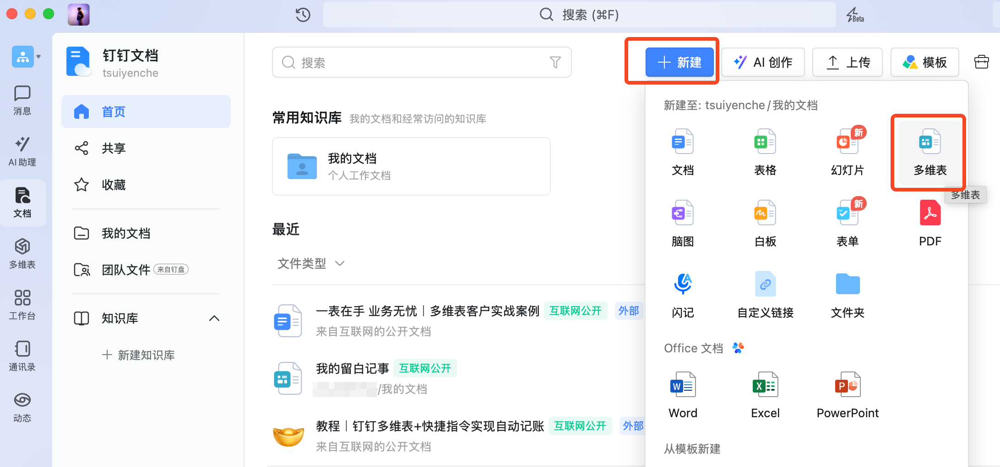

如上图，点击 `+新建`，选择 `多维表格`。

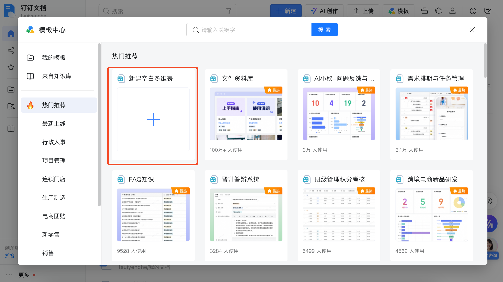

点击 `新建空白多维表`。

### 2. 编辑栏位

左上角 ↖️，可以对多维表重新命名，建议命名为 `xxx的留白记事`，其中 `xxx` 替换为你的名字。

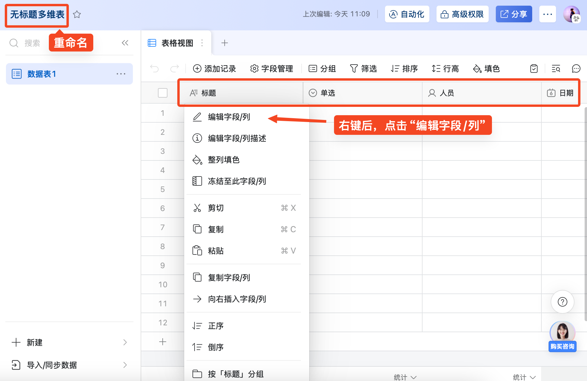

在多维表栏位上，逐一点击右键，选择 `编辑字段/列`。

第一栏我们填入 `卡片唯一值`，选择 `文本`，如下图所示：

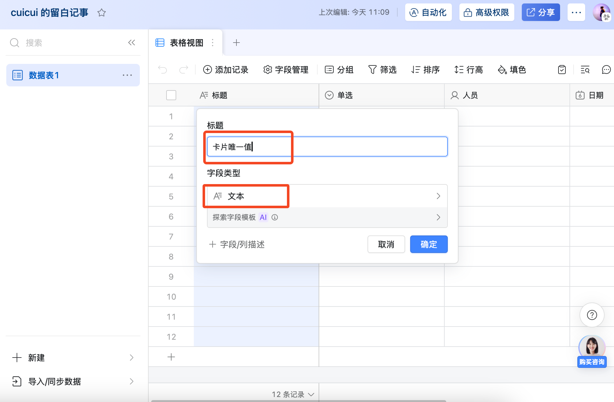

其他栏位依样画葫芦，我们总共需要 5 栏：

- `卡片唯一值`: 文本
- `内文`: 文本
- `可选的标题`: 文本
- `接收时间`: 日期
- `来源`: 文本

最后配置完，长这样：

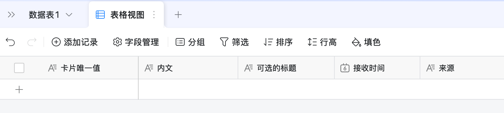

这是我[配置完的结果](https://alidocs.dingtalk.com/i/nodes/y20BglGWOGLj1zreSEowkG4eWA7depqY)，供你参考。

### 3. 自动化

点击右上角 ↗️ 的 `自动化`，如下图所示：


然后点击 `从空白新建`：

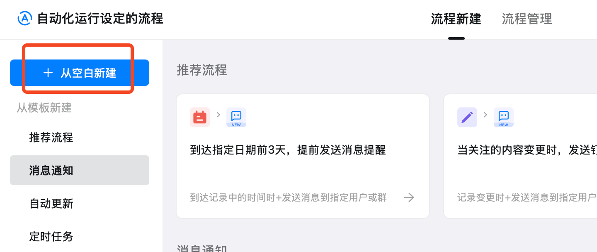

左上角 ↖️ 可以重命名流程，建议命名为 `从留白备份到钉钉`；接着，在右下角 ↘️ 找到 Webhook `接收到数据时`，点击它。

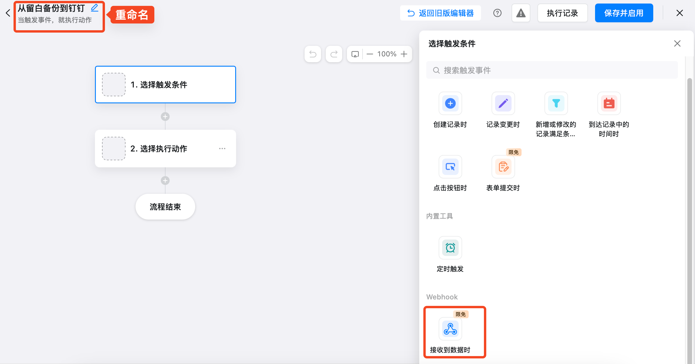

### 4. Webhook

在**关键词1**处，填入 `liubai`

在**参数格式**处，选择 `JSON`

在**参数示例**的部分，复制以下内容，粘贴上去：

```json
{
  "id": "你的卡片 id，会由留白自动生成",
  "desc": "你在留白的输入会被放进这里",
  "title": "这是可选的标题",
  "source": "可能的来源"
}
```

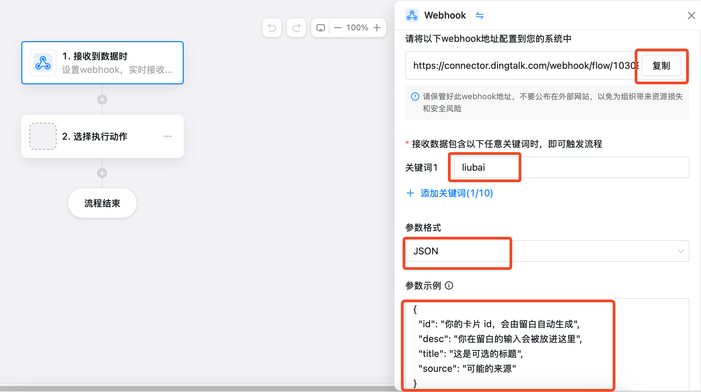

接下来，按上图所示，我们点击 `复制`，把 Webhook 地址复制到剪贴板里。

紧接着，将它粘贴到[留白记事](https://my.liubai.cc/connect/dingtalk)上，点击`保存`，如下图所示。

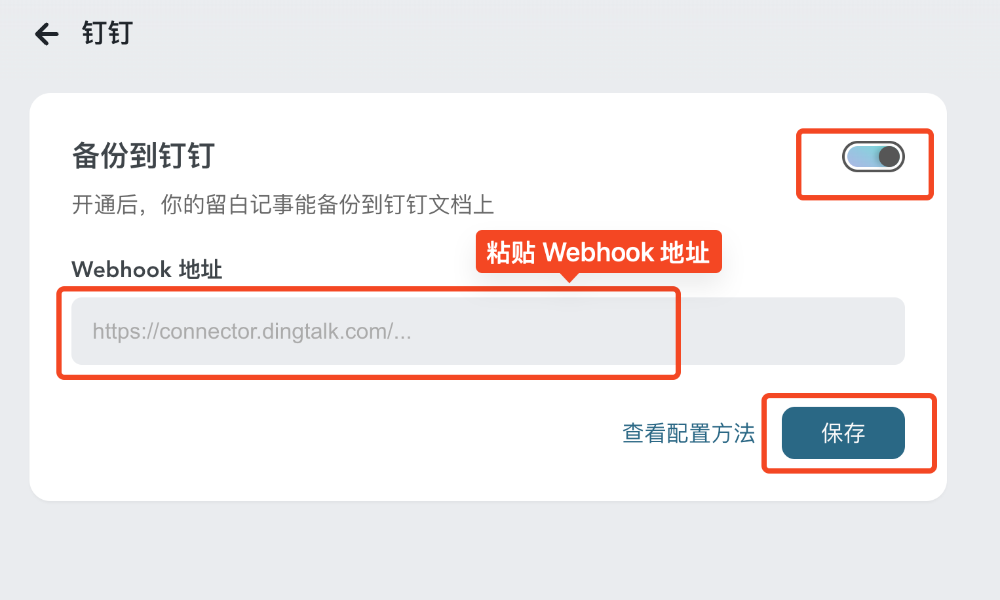

### 5. 新增记录

回到钉钉上，我们点击 `2. 选择执行动作`，选择 `新增记录`：

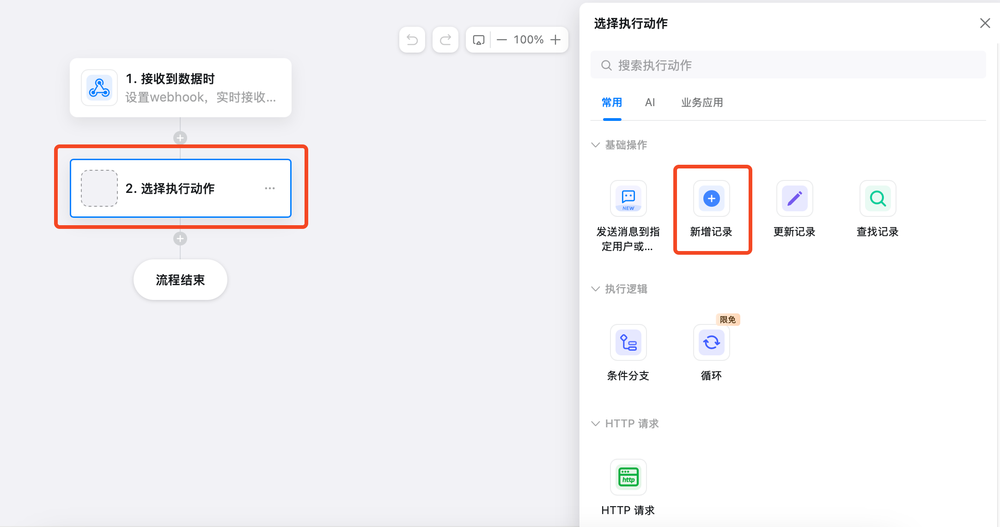

我们开始连连看，把留白的进来的数据连接到多维表格的各个字段上。

以 `卡片唯一值` 为例，我们点击 `+设置字段值`，然后点击 `卡片唯一值`：

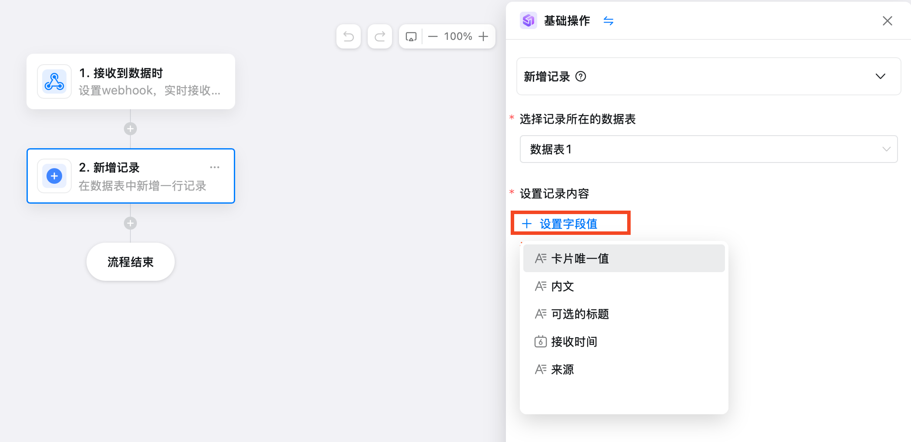

紧接着点击输入框右侧的 `+` 插入变量，选择 `id`:

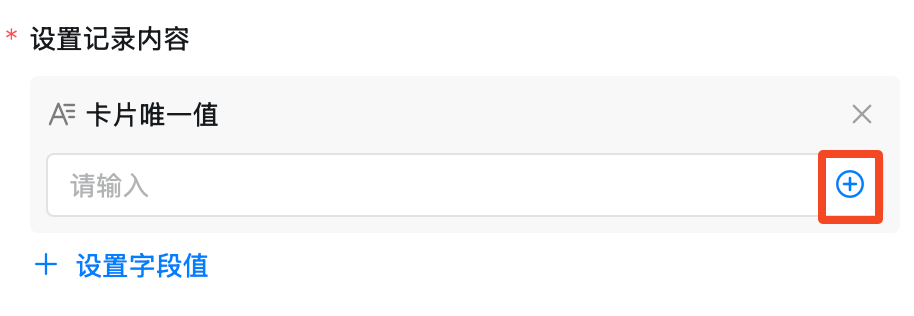

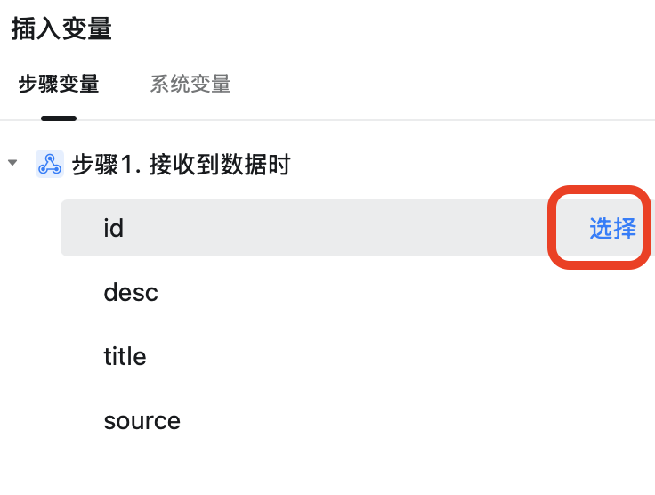

接着依序配置：

- **内文**: `desc`
- **可选的标题**: `title`
- **接收时间**: `今天（流程触发时间）`
- **来源**: `source`

其中，`接收时间` 要选择 `系统变量` 下的 `今天（流程触发时间）`：

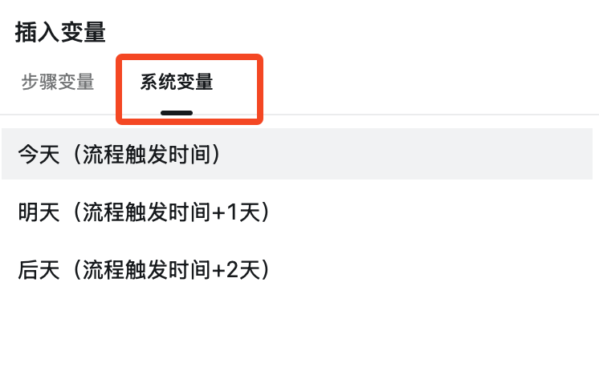

配置完毕，长这样：

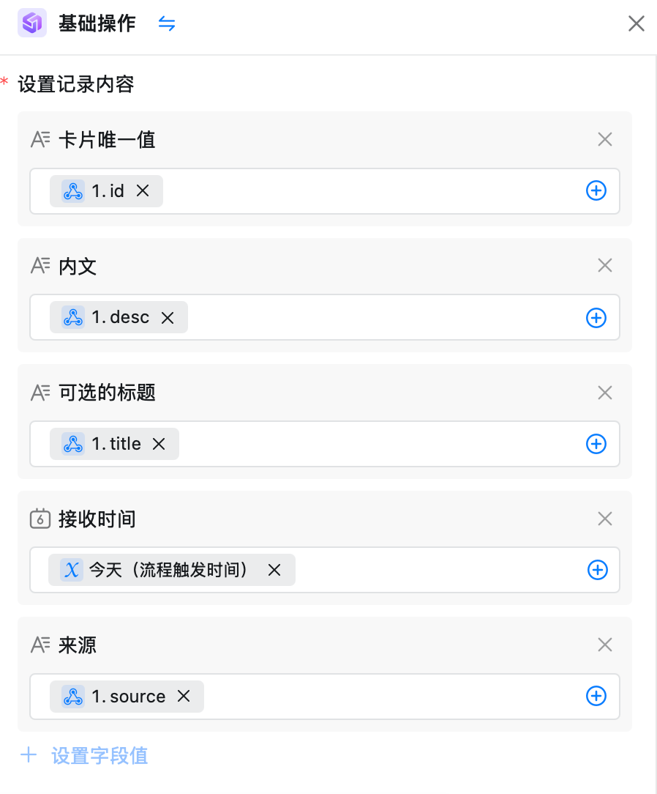

### 6. 完成 🎉

最后，我们点击 `保存并启用`，就大功告成了！


现在，你回到留白记事上做记录，测试一下新的记事是否能备份到钉钉上。

## 常见问题

### 1. 只能备份吗？可不可以双向同步？

“在第三方云文档上的编辑，需要同步到留白”

“在留白上更新某个字段又要同步过去”...... 

这将引发一系列需求，没完没了，同时可能存在安全隐患（比如循环触发），故“同步”功能目前没有计划。

“备份”很简单，这很留白。

### 2. 编辑后，不会同步到 WPS 上？

同问题一，同步会引发**数据一致性**的问题，故不支持。

目前，你能在留白上看到最新数据，在钉钉上保留你的初始记录。

一切有迹可循，这很优雅！


