# 连接到飞书

我们提供保姆级简易配置方法，让你无需企业或组织的管理员权限，轻松把留白上的记事备份到飞书多维表格上。

配置仅需 10 分钟；超时者，请直接 [联系客服](https://work.weixin.qq.com/kfid/kfcfb6f3959d36f6a0f)，送你一个月会员。

## 开始

### 1. 使用模板

打开这个链接: https://z80ygnlbge.feishu.cn/wiki/Mw2swUhONiR5v0kao66c5ds4nlg

点击页面上，或弹窗上的，`使用该模板` 按钮：

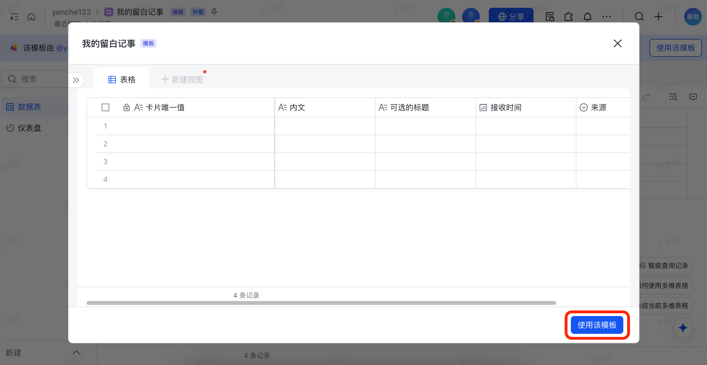

 

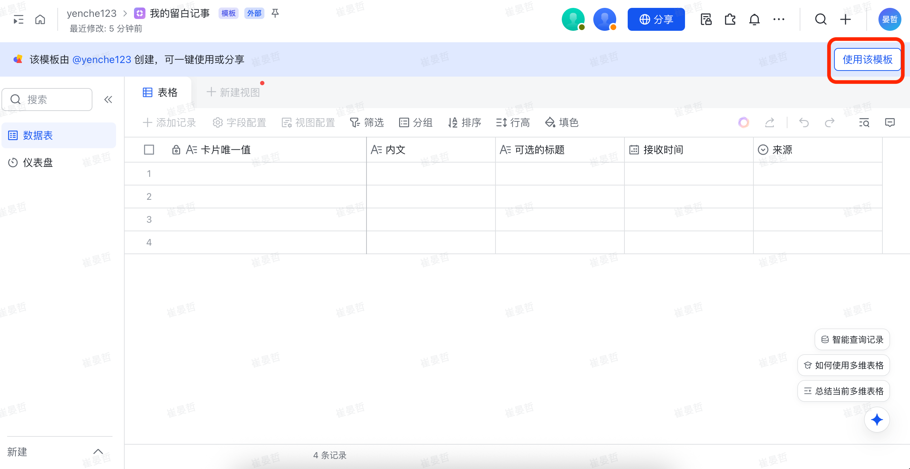

如果找不到 `使用该模板`，点击右上角 `...`，选择 `创建副本`：

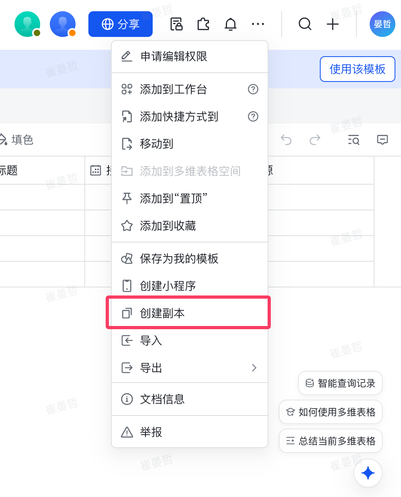

选择 `仅多维表结构` 再进行 `复制`：

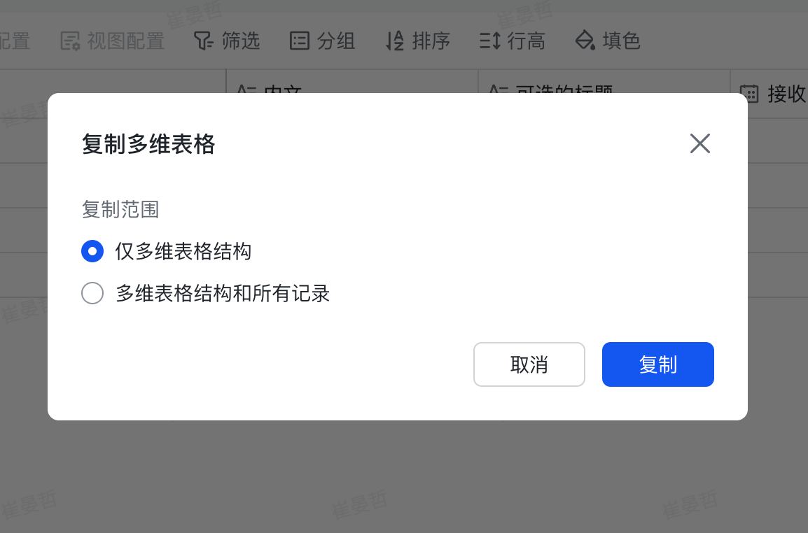

::: tip 小提示
过程中，若您未登录，飞书可能提醒你登录。
:::

### 2. 获取授权码

打开副本后，点击右上角的 `插件🧩` 按钮：

再点击 `自定义插件`：

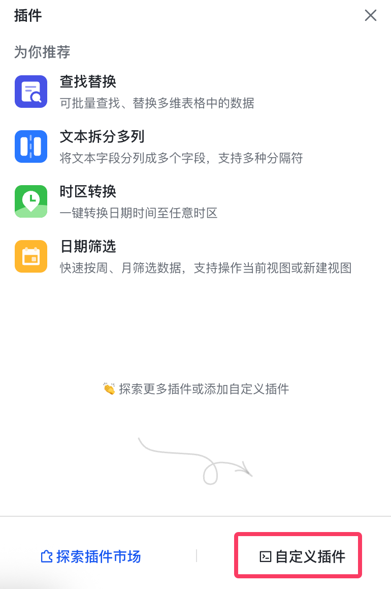

点击 `获取授权码`：

点击 `启用授权吗`，然后复制授权码：

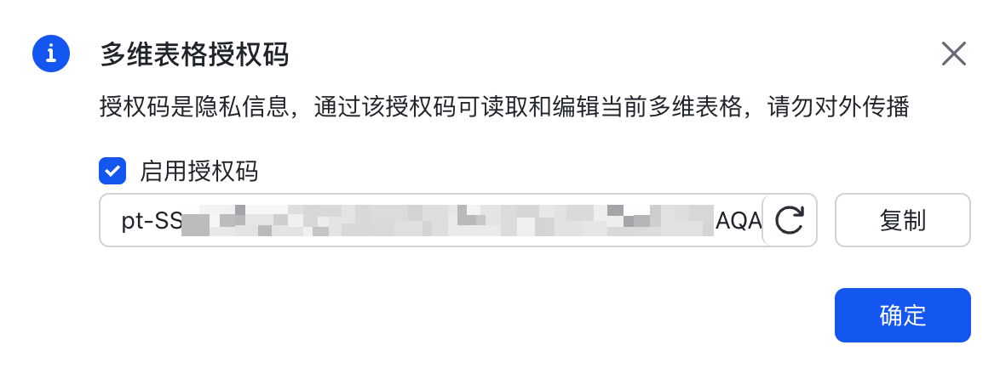

将授权码粘贴到 [留白记事 - 连接 - 飞书](https://my.liubai.cc/connect/feishu) 上：

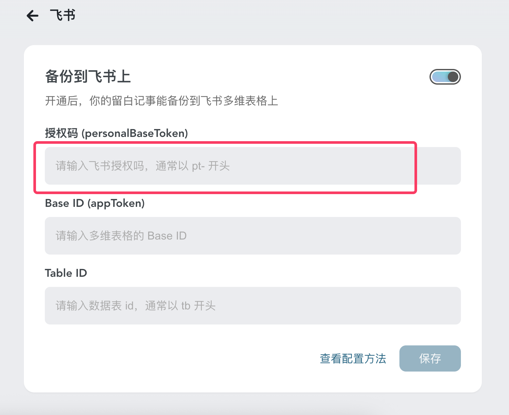

### 3. 再两个参数

接下来，为了让留白记事知道你的多维表格在哪里，我们来获取 `Base ID` 和 `Table ID`。

回到飞书你的多维表格上，一样点击 `插件🧩` 按钮，这次点击 `探索插件市场`：

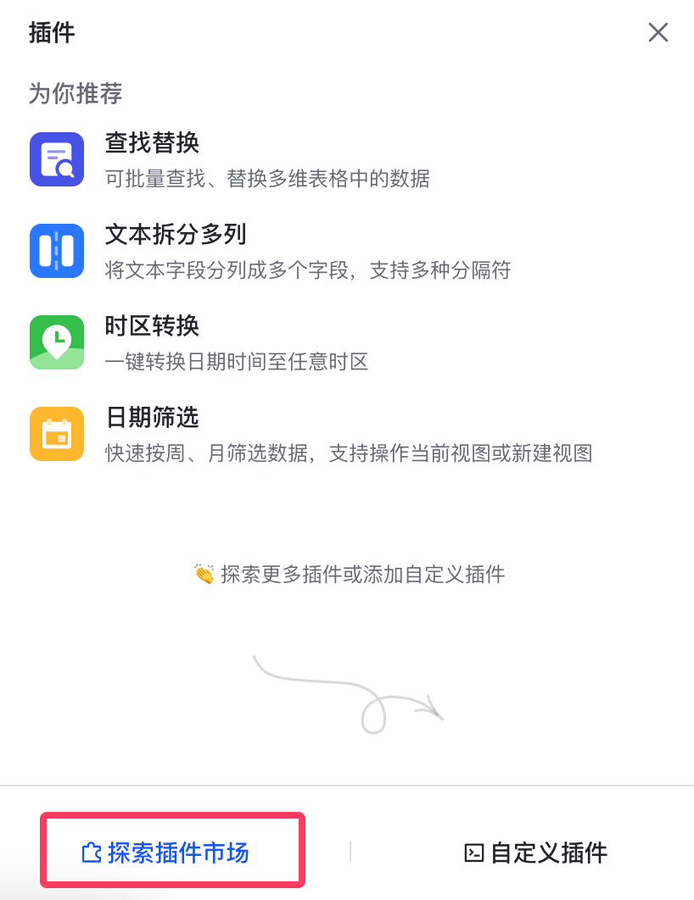

找到 `开发工具`，并 `使用`：

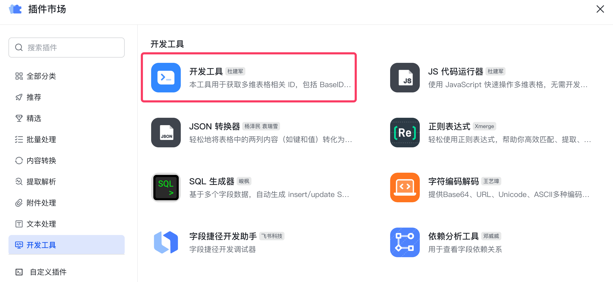

 

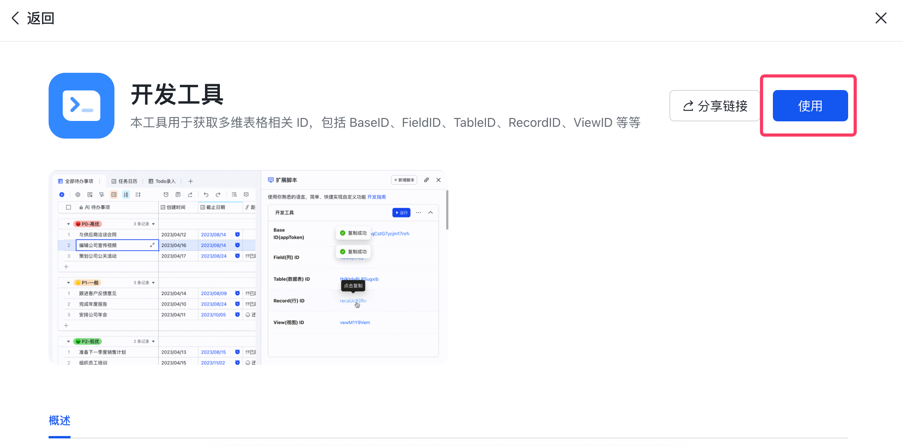

嘿嘿，复制 `Base ID` 和 `Table ID`：

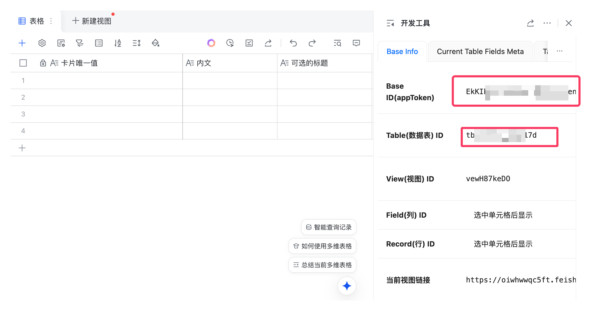

回到留白记事上，将它们分别粘贴上去：

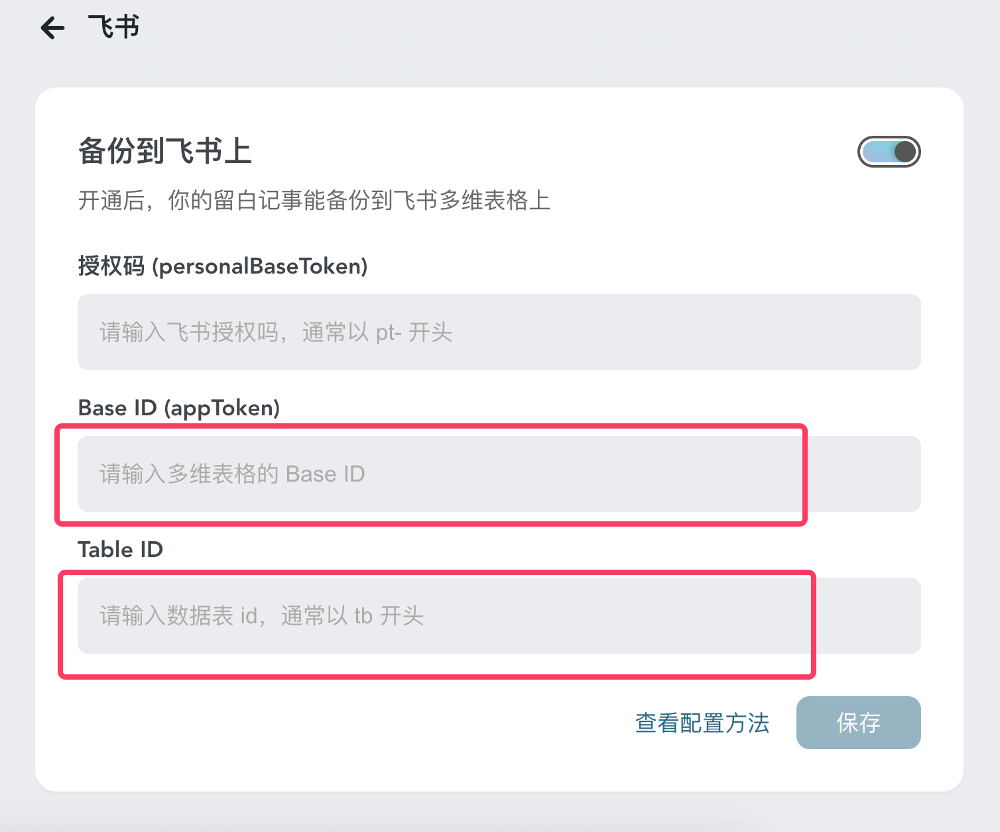

然后点击 `保存`。

### 4. 完成 🎉

现在你可以回到 [留白记事](https://my.liubai.cc/) 首页上记录，同时观察你的 **飞书多维表格** 有没有来自留白的记事！

## 常见问题

### 1. 只能备份吗？可不可以双向同步？

> “在第三方多维表格编辑，需要同步到留白”
> 
> “在留白上更新某个字段又要同步过去”...... 

这将引发一系列需求，没完没了，同时可能存在安全隐患（比如循环触发），故“同步”功能目前没有计划。

“备份”很简单，这很留白。

### 2. 编辑后，不会同步到飞书上？

同问题一，同步会引发数据一致性的问题，故不支持。

在留白上查看最新记录，在飞书上留档你的旧数据。

各司其职，这很优雅！
