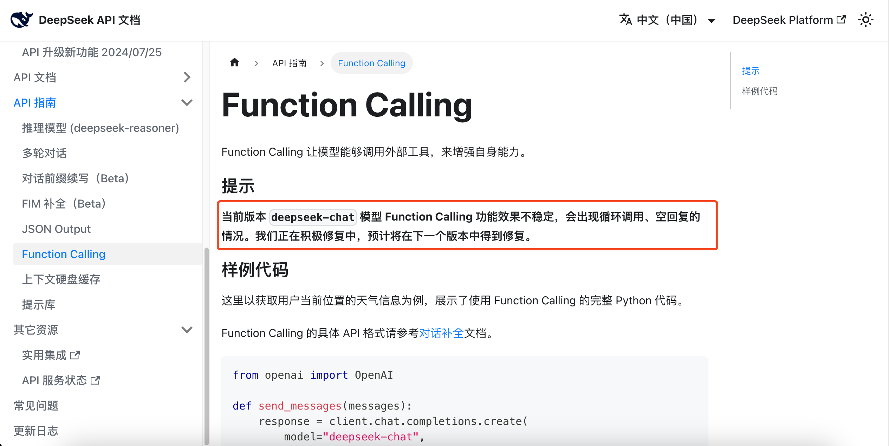

# 提问箱

欢迎来到留白记事提问箱！📦

若你的问题无法在这里被找到，你可以：

1. 在当前页面，点击屏幕右侧的“提问箱”按钮，直接提问。
2. 使用[客服通道](https://work.weixin.qq.com/kfid/kfcfb6f3959d36f6a0f)与我们联系。

## 重要

### 1. 请问 LIUBAI 的虚拟货币是你们官方创建的项目吗？ {#it-is-not-us}

> [!IMPORTANT]
> 我们没有发布任何虚拟代币！
>
> We never release any virtual tokens!

## 关于三个助手 {#three-assistants}

以下若没有特别标注，`次数` = `轮数` = `一轮会话`。

### 1. 怎么计算“一轮会话”？

当你单发一条或连发多条消息，被任一个或多个助手回复时，计入一轮会话。举例：

- 连发了 3 条消息，这三条消息间没有助手回复，过了 15 秒之后，分别被 2 个助手回复，那么计入 1 轮会话。
- 仅发了 1 条消息，被 3 个助手回复，那么计入 1 轮会话。
- 连发了 2 条消息，没有任何助手回复，不计入会话。

当前免费版共拥有 10 轮会话的权益，Premium 会员享有每月 200 轮会话的权益。

### 2. 每月 200 轮会话不够用怎么办？

续费。续费之后，当月已使用次数将立即被清零。

### 3. Premium 会员，每月 1 号已使用轮数将被清零吗？

每月 1️⃣ 号，系统会对 Premium 会员，进行以下检测：

- 会员有效期大于一个月者，清零已使用次数。
- 上一次续费（或初次付费）距今超过一个月者，清零已使用次数。

举例：

- 小明会员在 2 月 25 日过期；在 3 月 1 日时，已使用次数自然不会被清零。
- 小明在 2 月 27 日发现会员已过期，于是马上续费了一个月；在 3 月 1 日时，已使用次数不会被清零，因为在 2 月 27 日小明续费的当下，已使用次数已被清零。
- 小明在 2 月 27 日续费完后，跟“三个助手”狂聊 200 轮，在 28 日又续费了一次，会员有效期被延展到 4 月 27 日；在 3 月 1 日时，已使用次数将被清零，因为会员有效期大于一个月；在 4 月 1 日时，已使用次数还会被清零，因为上一次续费（或初次付费）距今超过一个月。

从上面案例得知，一直续、一直爽。

### 4. 如何查看当前已使用次数？

在“留白记事”微信公众号上，回复 `群聊状态` 即可。

### 5. 为什么电脑版微信，点击“继续...”“踢掉...”无效？

属于微信的 Bug。

另外，我们也建议在手机微信上使用，让它成为你的智能口袋；毕竟在 PC 端电脑上，你其实有更多选择。

### 6. 我能不使用“三个助手”，单纯在“留白记事”上记录吗？

当然可以！

“三个助手”是可选项，只要你不主动触发，他们不会打扰你，更不会去读取你所记录的内容。

留白是你的生活底座，当你觉得助手碍事时，完全可以不使用它。

### 7. 我能只跟“三个助手”聊天，而不使用留白记事吗？

当然可以！

广义来说，留白记事包含多个助手（模型）间的调度和协同。所以当你在跟“三个助手”聊天时，已经在使用留白记事了。

如果你没有记录的习惯或需求，当然无需使用 [my.liubai.cc](https://my.liubai.cc) 或 APP。

### 8. 三个助手之间是独立运行的吗？

在一轮会话中，三个助手是独立回答的。

当有助手先回话时，其他助手是无法得知的。

只有在下一轮会话被你发起后，助手们才会得知其他助手上一轮或更之前的聊天记录。

::: tip
值得注意的是，我们对 `继续` 指令做了格外处理。在规则上，它等同于发起新一轮的对话，但是关于上一轮的回答，其他助手的回复不会被传给“被继续的助手”。
:::

### 9. “免费版共拥有 10 轮会话的权益”是永久的10条吗？ {#freemium-forever}

目前是。随着成本逐渐下降，我们会考虑提升免费版额度，或改为每月皆有额度的可能。

可以很坦白的和您分享，我们目前是亏损的。连一个人都养不活的那种。

### 10. 可以自定义 API Key 吗？ {#api-key}

被问太多次了，有这个计划，而且应该会很有趣，敬请期待！

但优先级不高，需要一点时间。

### 11. 为什么 DeepSeek 有时候不会回复我？ {#function-calling-from-deepseek}

大致有两个原因：

1. DeepSeek 后端资源紧张。随着 2025 年 1 月 DeepSeek V3 和 DeepSeek R1 的发布，越来越多用户开始使用 DeepSeek 官方提供的服务，无论是通过 API、网页还是应用程序。这种增长导致其后台资源承受了显著压力，从而可能对您的提问体验产生一定影响。
2. DeepSeek 目前在使用工具调用时，可能会出现循环调用的问题。例如，大模型请求调用搜索工具，当我们返回搜索结果后，大模型可能会再次触发搜索请求。目前（2025-01-28）这一现象，你也能在 DeepSeek [官网](https://api-docs.deepseek.com/zh-cn/guides/function_calling)上得到确认。

## 会员权益 {#member-privilege}

### 1. 免费版超过 50 条笔记，就不让用了？

依然可用，只是会为你删除最旧的记事。

目前尚未执行该措施，但不排除未来开始执行，这是目前最经济最廉价模拟记忆衰减的方式。

### 2. 啥叫到府维修？

线上无法复现或定位的 Bug，我们去找客户真机看问题。

该服务仅限年度会员可兑换，并且终身一次。

## 搞抽象 {#abstraction}

### 1. 为什么有手机备忘录，还要用留白记事？

> 为什么有肯德基，还要吃麦当劳？
> 
> 为什么有星巴克，还要喝 Manner?
> 
> 为什么有蔚小理，还要开小米汽车？
> 
> 为什么有山姆，还要逛胖东来？

商业世界的精彩正在于它的多元和百花齐放。

更令人好奇的是，留白记事只是备忘录吗？

Liubai = Your "Notes + Calendar + Todo List + Task" with AI

<ClientOnly>
  <HowxmForm />
</ClientOnly>

