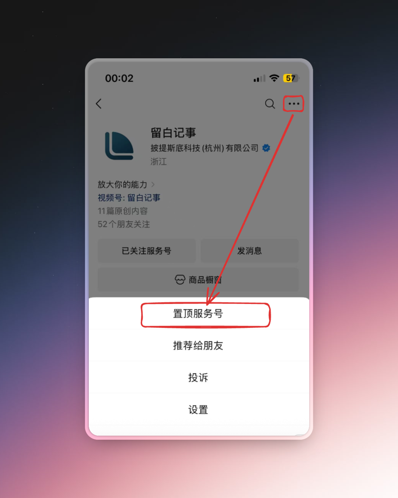
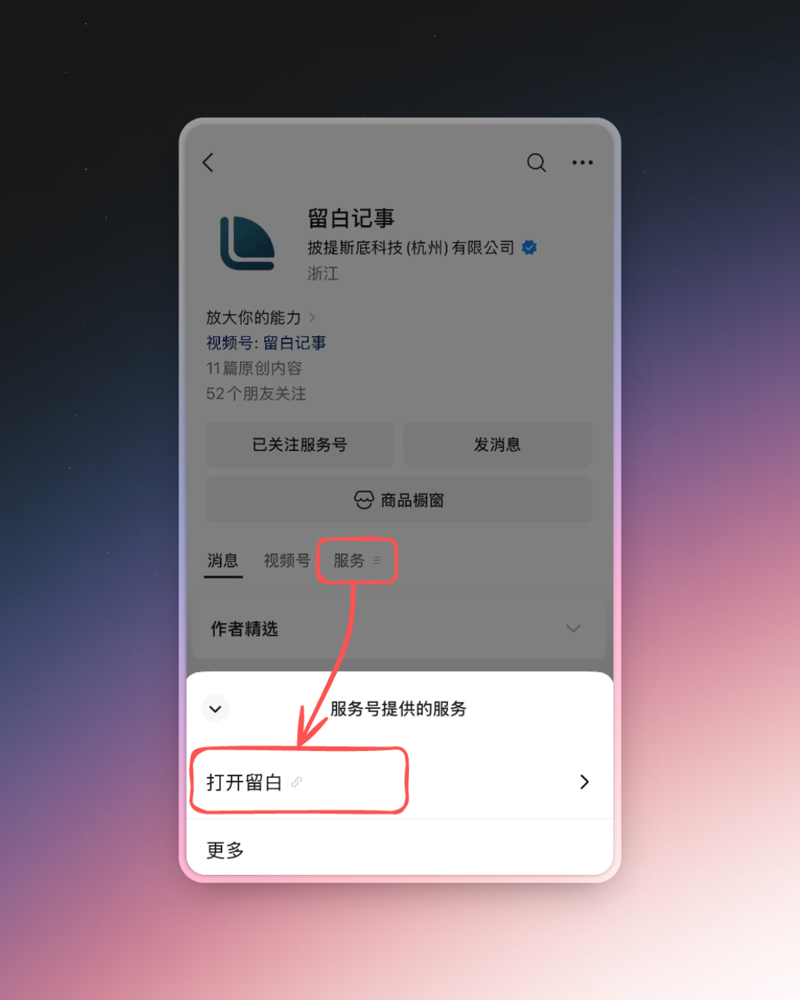
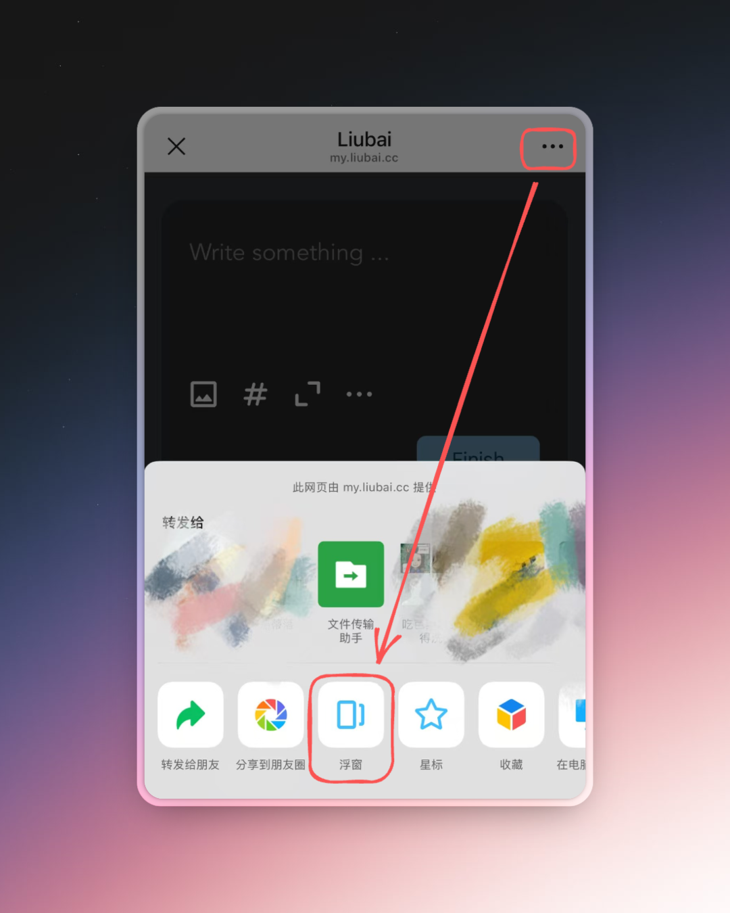
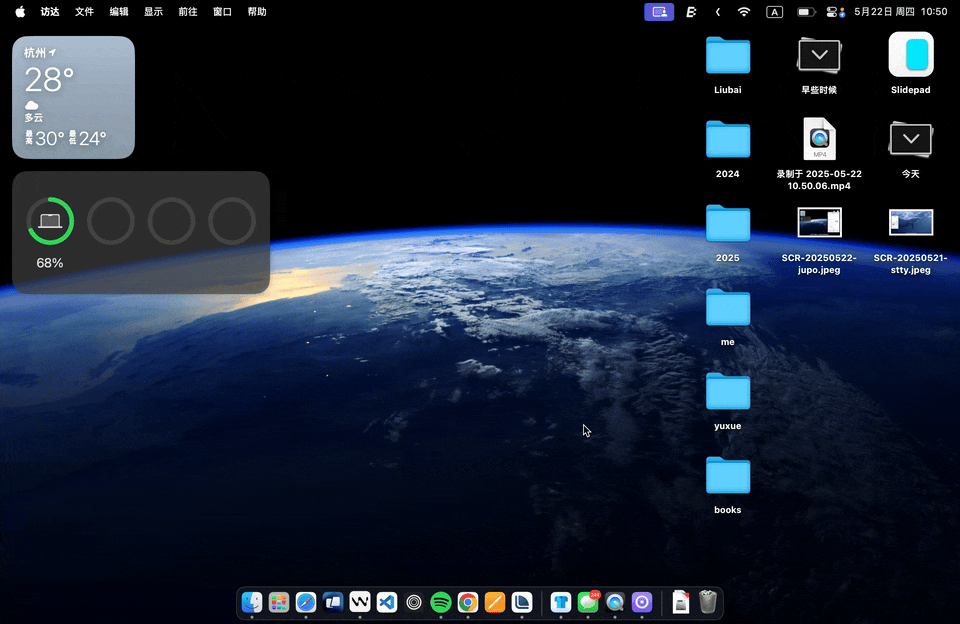

# 智能口袋

微信提供 `置顶服务号` 和 `浮窗` 两个功能。搭配留白记事使用，会变得非常好用！

## 置顶服务号

扫描上方二维码关注服务号，点击右上角的 `...` → `置顶服务号`：

现在你可以随时在微信列表里找到它，随时记录、随时询问 AI 任何事！

## 浮窗 {#float-window}

扫描上方二维码关注服务号，点击 `服务`，再点击 `打开留白`:

接着点击右上角的 `...` → `浮窗`：

就这么简单，你的智能口袋已经配置完毕！

现在，你可以在微信的任何地方打开留白，随意记录任何事情！

::: info 使用案例

用微信扫描下方二维码👇，在视频号上查看使用案例。

:::

## 侧边栏 {#slidepad}

如果你是 macOS 用户，可以安装 [Slidepad](https://slidepad.app/)（免费的），添加 `my.liubai.cc`，就可以在全局电脑中，鼠标右滑展开留白。

超丝滑～

随手记就这么简单。
