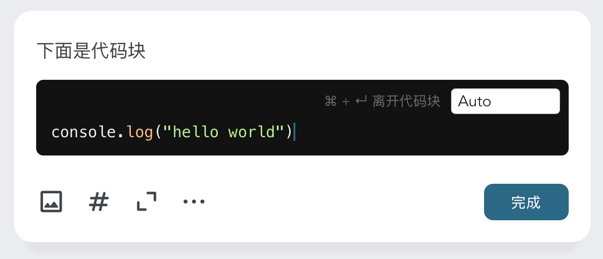

# Markdown 支持

留白记事支持简单的 Markdown 语法：

### 行内代码

在编辑器上，输入

```
` 你的行内文字 `
```

即可包裹行内代码。


### 粗体

在编辑器上，输入

```
** 你的粗体文字 **
```

即可用粗体包裹文字。


### 斜体

在编辑器上，输入

```
* 你的斜体文字 *
```

即可用斜体包裹文字。


### 链接

你可以使用 markdown 语法 `[链接文字](https://example.com)` 来创建文本链接。

在编辑器上：


点击完成后，自动美化：


将链接分成 `编辑态` 和 `浏览态`，可以有效地避免

1. 误触链接；
2. 不知道如何编辑 `文本` 和 `链接`，因为链接隐藏于文本中。

### 分割线

在行首的位置输入 `---` 即可创建分割线。


### 有序列表

在行首输入 `1.` 即可进入有序列表。

### 无序列表

在行首输入 `-` 即可进入无序列表。

### 代码片段

在行首输入三个 \` 并敲击回车，即可进入代码块：



在代码末尾：
- 连敲三次回车，或者
- `Ctrl + Enter` (macOS: `Cmd + Enter`)

即可离开代码片段。

## 其他注意事项

留白记事不支持 h1 / h2 / h3 ...... 等标题，因为我们想让你记录事情就像发朋友圈或小红书一样简单。

我们也不支持图文混排和表格，这都是文章编辑时才需要的。

我们希望在留白里，一切都可以很简单。