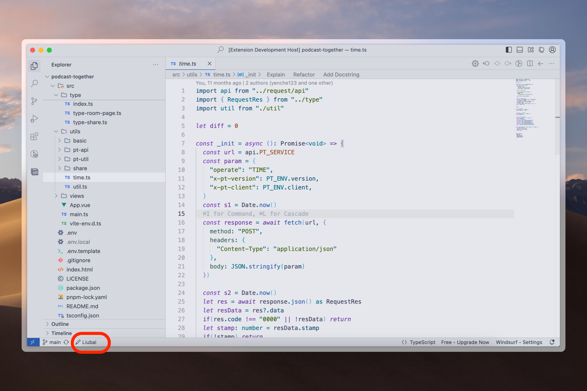
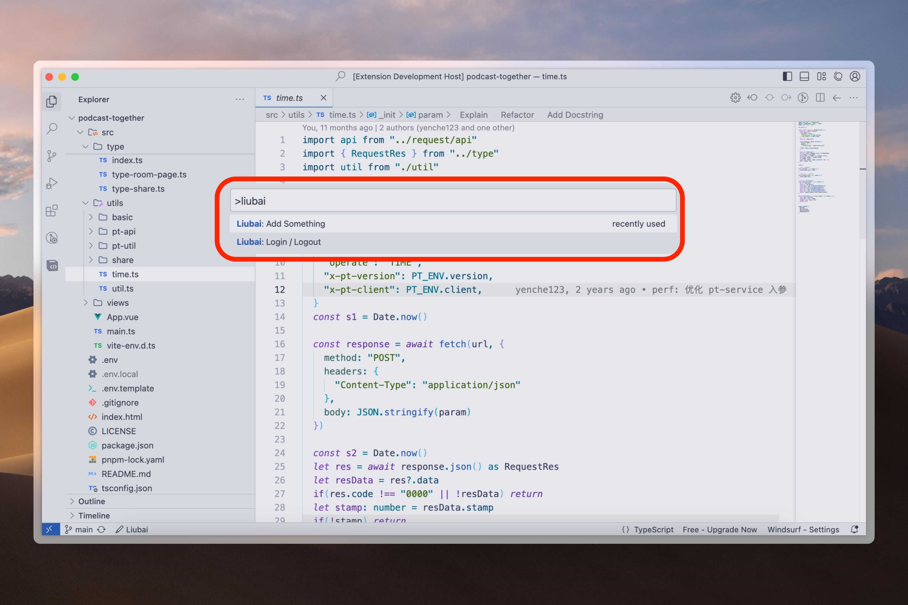
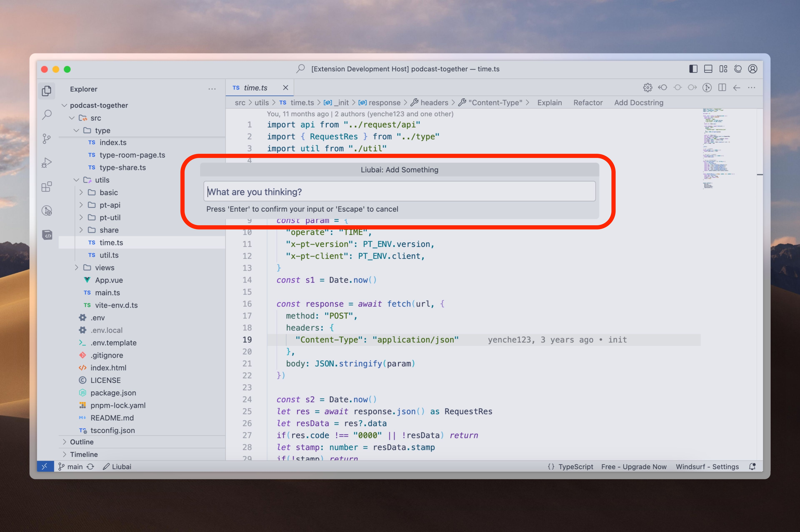
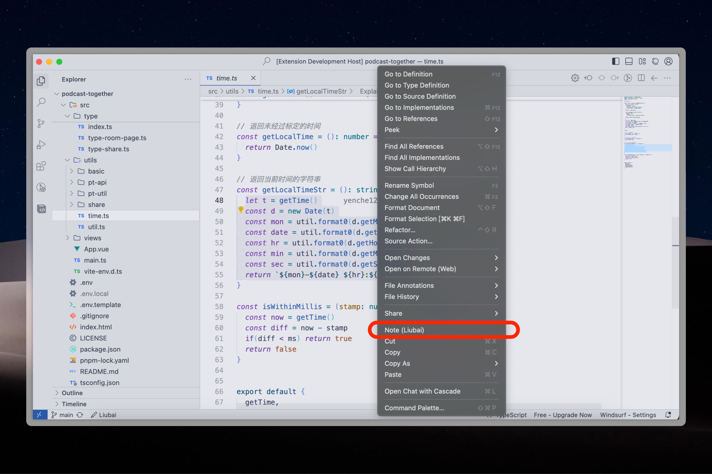
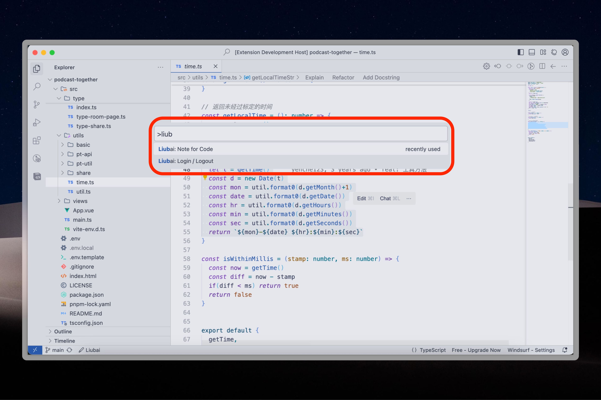
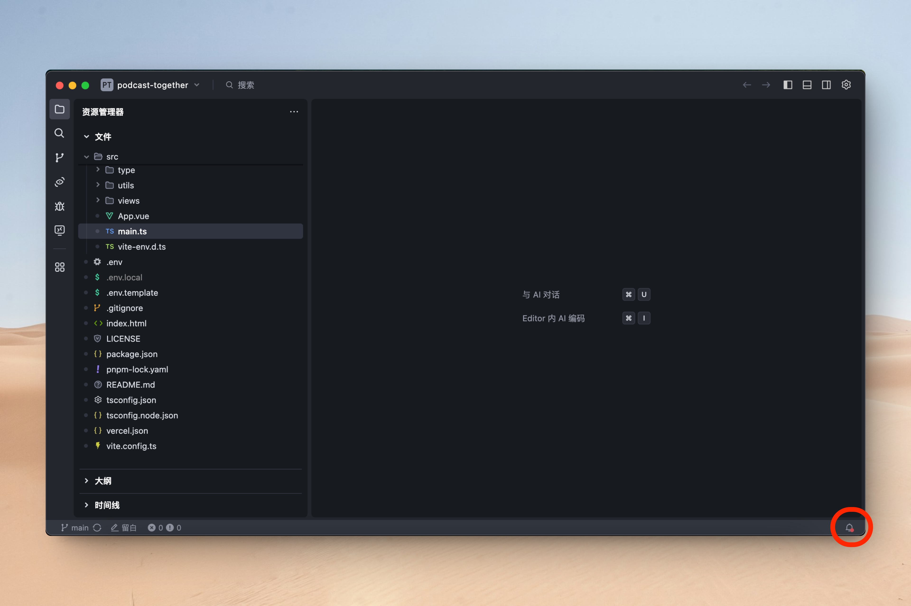
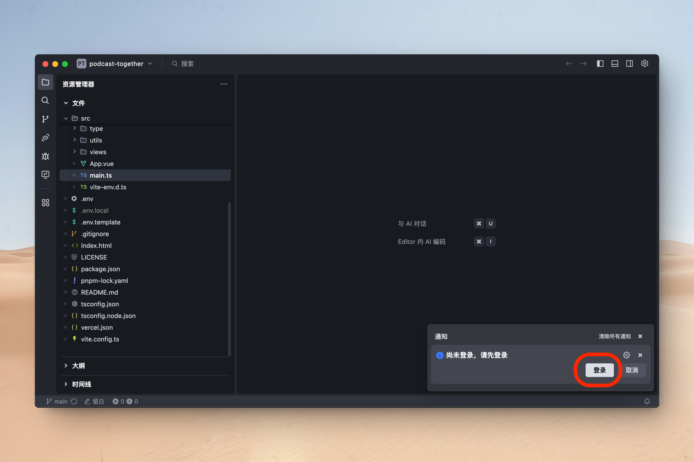

# 留白记事 vscode-based 插件

安装之后，有两个功能：

- 快速记事
- 备注代码

## 快速记事

点击窗口左下角的 `Liubai`，如下图所示。

或者

- `Cmd + Shift + P`（macOS）
- `Ctrl + Shift + P`（Windows）

唤起命令面板，输入 `liubai`，选择 `Add Something`，如下图所示。

紧接着输入任何你想记录的一件事，并按下回车 `Enter`，即可记录。

过程中，插件若发现你尚未登录，按照提示登录即可。

## 备注代码

在编辑器中，选中任何代码，右键弹出菜单栏，选择 `Note (Liubai)`，如下图所示。

或者

- `Cmd + Shift + P`（macOS）
- `Ctrl + Shift + P`（Windows）

唤起命令面板，输入 `liubai`，选择 `Note for Code`，如下图所示。

紧接着输入你想备注的文字，或者直接按下回车 `Enter`，即可保存。

## 问题排查

### 1. 为什么在状态栏上点击左下角的 ✏️ Liubai 没有反应？

通常是 IDE 把通知收起来导致的。

在状态栏最右侧，有一个 🔔 图标，点击后就会展开通知了，如下二图所示。

